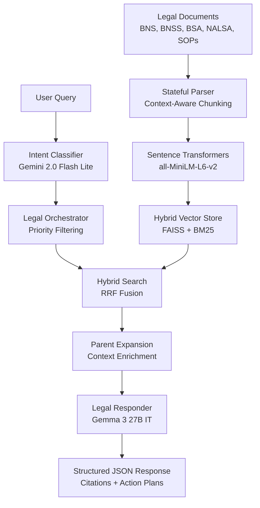

# Indian Legal RAG Engine (V3)

A high-precision Retrieval-Augmented Generation (RAG) system specialized in Indian Law. This engine is designed to bridge the gap between complex legal statutes and citizen understanding, with a specialized **Victim-Centric** focus for individuals.

---

## �️ Tech Stack

### Backend & Core

- **Python 3.10+**: Core runtime environment
- **FastAPI**: High-performance async web framework for REST API
- **Uvicorn**: ASGI server with standard extras for production deployment
- **Pydantic**: Data validation and settings management

### Machine Learning & AI

- **Google Gemini API** (`google-genai`): Multi-model LLM orchestration
    - **Gemini 2.0 Flash Lite**: Fast classification and intent detection
    - **Gemma 3 27B IT**: Advanced legal reasoning and response generation
- **Sentence Transformers**: Embedding generation (`all-MiniLM-L6-v2`)
- **NumPy**: Numerical operations and vector manipulation

### Search & Retrieval

- **FAISS** (`faiss-cpu`): High-performance vector similarity search
- **Rank BM25**: Keyword-based sparse retrieval for exact matching
- **Hybrid Architecture**: Combines semantic and lexical search with RRF (Reciprocal Rank Fusion)

### Document Processing

- **PyMuPDF**: PDF text extraction and processing
- **PDFPlumber**: Advanced PDF parsing for tables and structured data
- **Custom Stateful Parser**: Context-aware legal document chunking

### API & Server

- **FastAPI**: RESTful API with automatic OpenAPI documentation
- **CORS Middleware**: Cross-origin resource sharing for frontend integration
- **Environment Management**: `python-dotenv` for configuration

### Utilities & CLI

- **Click**: Command-line interface framework
- **Rich**: Terminal formatting and progress visualization
- **TQDM**: Progress bars for batch operations

---

## �🚀 Key Features

### 1. Victim-Centric Intelligence

The system dynamically detects if a user is in distress (e.g., reporting a crime) using **Gemini 2.0 Flash Lite** for real-time intent classification. In such cases, it prioritizes:

- **🚨 Safety Alerts**: Immediate critical advice (e.g., "Dial 112").
- **📋 Immediate Action Plans**: Chronological, simple-language steps for legal recourse.
- **Empathetic Response**: Answers use supportive, Grade 8 level language.

### 2. Hybrid Retrieval Pipeline

Combines the best of semantic and keyword search to ensure no critical legal clause is missed:

- **FAISS (Semantic)**: Uses `all-MiniLM-L6-v2` embeddings (384 dimensions) to understand the legal intent behind queries.
- **BM25 (Keyword)**: Ensures exact matches for section numbers, specific acts, and legal terminology.
- **RRF Fusion**: Reciprocal Rank Fusion merges results from both retrievers with configurable weights.

### 3. Legal Intelligence Modules

- **Stateful Ingestion**: Specialized parsers for **BNS (2023)**, **BNSS**, **BSA**, **NALSA Schemes**, and **Police SOPs**.
- **Parent Expansion**: Automatically includes parent section headers for sub-units (Illustrations, Exceptions, Provos) to preserve legal context.
- **Multi-Model Support**: Seamlessly orchestrates between **Gemini 2.0 Flash Lite** and **Gemma 3 27B IT** for classification and response generation.

---

## 🏗️ Architecture



### Pipeline Stages

1. **Document Ingestion**: Stateful parser processes legal documents with context preservation
2. **Embedding Generation**: Sentence Transformers create 384-dim vectors for semantic search
3. **Index Creation**: FAISS index for vector search + BM25 for keyword matching
4. **Query Classification**: Gemini 2.0 Flash Lite detects intent (victim/general/legal research)
5. **Hybrid Retrieval**: RRF fusion combines FAISS and BM25 results
6. **Context Expansion**: Parent section headers added to preserve legal hierarchy
7. **Response Generation**: Gemma 3 27B IT generates structured answers with citations

---

## � Data Sources

The engine is trained on authoritative Indian legal documents:

- **Bharatiya Nyaya Sanhita (BNS), 2023**: Replaces the Indian Penal Code (IPC)
- **Bharatiya Nagarik Suraksha Sanhita (BNSS), 2023**: Replaces the Code of Criminal Procedure (CrPC)
- **Bharatiya Sakshya Adhiniyam (BSA), 2023**: Replaces the Indian Evidence Act
- **NALSA Compensation Scheme, 2018**: Victim compensation guidelines
- **Police Standard Operating Procedures (SOPs)**: Procedural guidelines for law enforcement

All documents are parsed into structured chunks with preserved hierarchical context (Part → Chapter → Section → Sub-section).

---

## �🛠️ Setup & Installation

### 1. Environment Variables

Create a `.env` file in the root directory:

```env
GEMINI_API_KEY=your_google_api_key
EMBEDDING_MODEL=sentence-transformers/all-MiniLM-L6-v2
LLM_MODELS=gemini-2.0-flash-lite,gemma-3-27b-it
```

### 2. Installation

```powershell
pip install -r requirements.txt
```

### 3. Data Initialization

If you are setting up for the first time or updating documents:

```powershell
# 1. Parse and chunk legal documents
python ingest_legal_docs.py

# 2. Generate embeddings and FAISS index
python create_vector_store.py
```

---

## 🖥️ Usage

### Running the API Server

The system uses FastAPI for a production-ready interface.

```powershell
python -m src.server.app
```

_Server runs at `http://localhost:8000`_

### Querying the Engine

You can use the built-in testing script to verify the full RAG cycle:

```powershell
python test_retrieval.py
```

---

## 🚀 Deployment (Render)

This project is configured for easy deployment on [Render](https://render.com) using the FastAPI + Uvicorn stack.

### Prerequisites

- Pre-built FAISS index in `data/vector_store/` (commit to Git)
- Google Cloud API key for Gemini models

### Deployment Steps

1. **Push to GitHub**: Ensure the `data/vector_store` folder is included in your commit.
    ```bash
    git add .
    git commit -m "Ready for deploy"
    git push
    ```
2. **Create Web Service on Render**:
    - Connect your GitHub repository to Render
    - Select **Python 3** environment
    - **Build Command**: `pip install -r requirements.txt`
    - **Start Command**: `uvicorn src.server.app:app --host 0.0.0.0 --port $PORT`
3. **Environment Variables** (Add in Render Dashboard):

    ```env
    GEMINI_API_KEY=your_google_cloud_api_key
    LLM_MODELS=gemini-2.0-flash-lite,gemma-3-27b-it
    EMBEDDING_MODEL=sentence-transformers/all-MiniLM-L6-v2
    ```

4. **Health Check**: Once deployed, verify at `https://your-app.onrender.com/health`

### Production Considerations

- **Cold Starts**: First request may take 10-15s to load models
- **Memory**: Recommended minimum 2GB RAM for FAISS index
- **API Rate Limits**: Monitor Gemini API quota usage

---

## 📂 Project Structure

```
Embedding-Test-Py/
├── src/
│   ├── retrieval/          # Core RAG Engine
│   │   ├── classifier.py   # Intent detection (Gemini 2.0 Flash Lite)
│   │   ├── orchestrator.py # Multi-stage retrieval & priority filtering
│   │   ├── retrieval_engine.py # Hybrid search (FAISS + BM25 + RRF)
│   │   ├── responder.py    # Answer generation (Gemma 3 27B IT)
│   │   └── parent_expander.py # Context enrichment module
│   └── server/             # FastAPI Application
│       ├── app.py          # Main API server with CORS
│       └── models.py       # Pydantic request/response schemas
├── documents/              # Source Legal Texts
│   ├── BNS/                # Bharatiya Nyaya Sanhita (split by chapter)
│   ├── BNSS/               # Bharatiya Nagarik Suraksha Sanhita
│   ├── BSA/                # Bharatiya Sakshya Adhiniyam
│   ├── nalsa.md            # NALSA Compensation Scheme
│   └── sop_*.md            # Police SOPs
├── data/
│   └── vector_store/       # Persistent FAISS index & BM25 metadata
├── ingest_legal_docs.py    # Stateful parser for document chunking
├── create_vector_store.py  # Embedding generation & index creation
├── test_retrieval.py       # Hybrid search benchmarking
├── test_quality.py         # Victim-centric QA suite
├── API_DOCS.md             # Frontend integration guide
└── requirements.txt        # Python dependencies
```

---

## 🧪 Testing & QA

The project includes a robust suite of verification tools:

- **`test_api.py`**: Verifies FastAPI endpoints and response codes.
- **`test_quality.py`**: Executes a "Victim-Centric" QA suite to ensure safety alerts and action plans are generated correctly.
- **`test_retrieval.py`**: Benchmarks the hybrid search precision.

---

## ⚖️ Disclaimer

This engine provides information based on legal texts but does **not** constitute professional legal advice. Always consult with a qualified legal professional for specific cases.
