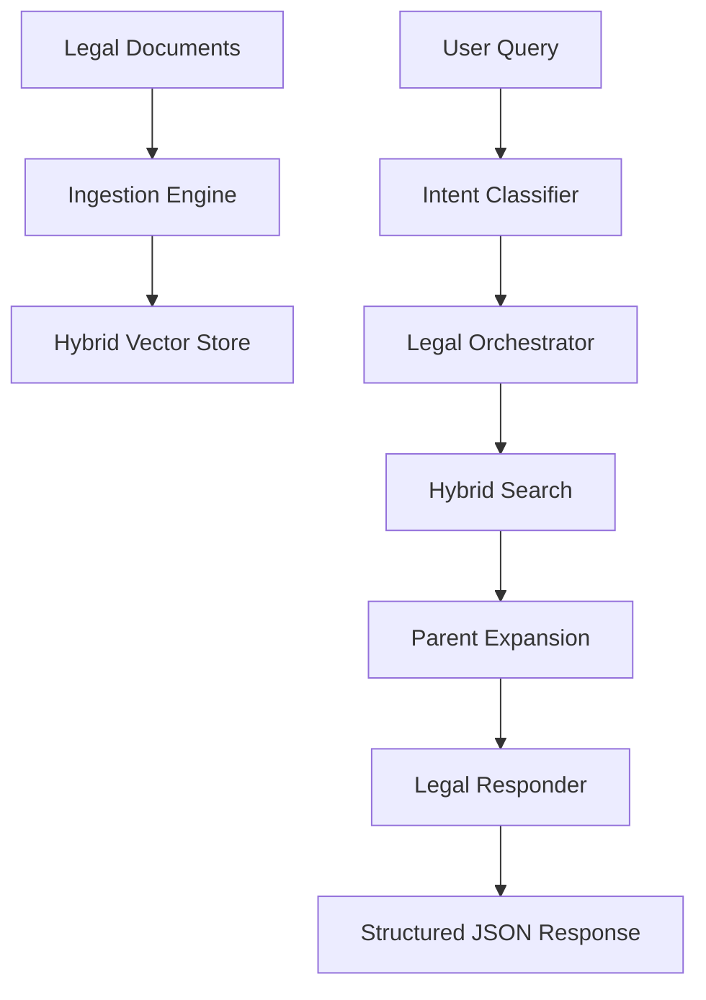

# Indian Legal RAG Engine (V3)

A high-precision Retrieval-Augmented Generation (RAG) system specialized in Indian Law. This engine is designed to bridge the gap between complex legal statutes and citizen understanding, with a specialized **Victim-Centric** focus for individuals in distress.

---

## 🚀 Key Features

### 1. Victim-Centric Intelligence

The system dynamically detects if a user is in distress (e.g., reporting a crime). In such cases, it prioritizes:

- **🚨 Safety Alerts**: Immediate critical advice (e.g., "Dial 112").
- **📋 Immediate Action Plans**: Chronological, simple-language steps for legal recourse.
- **Empathetic Response**: Answers use supportive, Grade 8 level language.

### 2. Hybrid Retrieval Pipeline

Combines the best of semantic and keyword search to ensure no critical legal clause is missed:

- **FAISS (Semantic)**: Uses `all-MiniLM-L6-v2` to understand the legal intent behind queries.
- **BM25 (Keyword)**: Ensures exact matches for section numbers, specific acts, and legal terminology.

### 3. Legal Intelligence Modules

- **Stateful Ingestion**: Specialized parsers for **BNS (2023)**, **BNSS**, **BSA**, **NALSA Schemes**, and **Police SOPs**.
- **Parent Expansion**: Automatically includes parent section headers for sub-units (Illustrations, Exceptions, Provos) to preserve legal context.
- **Multi-Model Support**: Seamlessly orchestrates between **Gemini 1.5/2.5** and **Gemma 3** for classification and response generation.

---

## 🏗️ Architecture



---

## 🛠️ Setup & Installation

### 1. Environment Variables

Create a `.env` file in the root directory:

```env
GEMINI_API_KEY=your_google_api_key
EMBEDDING_MODEL=sentence-transformers/all-MiniLM-L6-v2
LLM_MODELS=gemini-2.0-flash-lite,gemma-3-27b-it
```

### 2. Installation

```powershell
pip install -r requirements.txt
```

### 3. Data Initialization

If you are setting up for the first time or updating documents:

```powershell
# 1. Parse and chunk legal documents
python ingest_legal_docs.py

# 2. Generate embeddings and FAISS index
python create_vector_store.py
```

---

## 🖥️ Usage

### Running the API Server

The system uses FastAPI for a production-ready interface.

```powershell
python -m src.server.app
```

_Server runs at `http://localhost:8000`_

### Querying the Engine

You can use the built-in testing script to verify the full RAG cycle:

```powershell
python test_retrieval.py
```

---

## 📂 Project Structure

- `src/retrieval/`: **Core Engine**
    - `classifier.py`: Real-time intent and context detection.
    - `orchestrator.py`: Multi-stage retrieval logic and priority filtering.
    - `engine.py`: Main entry point for the RAG cycle.
    - `responder.py`: Structured legal answer generation.
- `src/server/`: **FastAPI Implementation**
- `documents/`: Source legal text (BNS, SOPs, etc.).
- `data/vector_store/`: Persistent FAISS index and BM25 metadata.
- `API_DOCS.md`: Detailed frontend integration and response schema guide.

---

## 🧪 Testing & QA

The project includes a robust suite of verification tools:

- **`test_api.py`**: Verifies FastAPI endpoints and response codes.
- **`test_quality.py`**: Executes a "Victim-Centric" QA suite to ensure safety alerts and action plans are generated correctly.
- **`test_retrieval.py`**: Benchmarks the hybrid search precision.

---

## ⚖️ Disclaimer

This engine provides information based on legal texts but does **not** constitute professional legal advice. Always consult with a qualified legal professional for specific cases.
