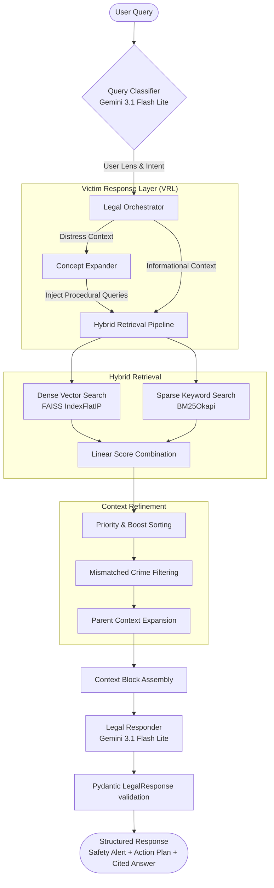

# Technical Report: Indian Legal RAG Engine (V3)
*A Victim-Centric Legal Intelligence & Guidance System*

---

## 1. Executive Summary

Traditional legal information retrieval systems are designed to answer static questions (e.g., *"What is the definition of assault?"*). However, for individuals in critical legal situations (e.g., victims of crime), abstract definitions are insufficient. They require immediate, actionable, and empathetic guidance (e.g., *"How do I file an FIR?"*, *"Where can I seek safety?"*, *"Am I entitled to compensation?"*).

The **Indian Legal RAG Engine (V3)** is a specialized retrieval-augmented generation (RAG) system built to bridge the gap between complex legal statutes and real-world human needs. Underpinned by a **Victim Response Layer (VRL)**, it dynamically classifies user intent, performs high-precision hybrid document retrieval, boosts procedural and protective sources during distress, and delivers structured responses complete with inline citations, safety alerts, and step-by-step action plans.

The engine supports the new Indian Criminal Laws (implemented in 2023):
* **Bharatiya Nyaya Sanhita (BNS)**: Substantive law defining offences and punishments.
* **Bharatiya Nagarik Suraksha Sanhita (BNSS)**: Procedural law governing reporting, investigation, and arrest.
* **Bharatiya Sakshya Adhiniyam (BSA)**: Rules of evidence admissibility.
* **NALSA Schemes**: State-sponsored victim compensation rules.
* **Police Standard Operating Procedures (SOPs)**: Real-world enforcement steps for police officers.

---

## 2. Architecture & System Dataflow

The system coordinates query understanding, multi-stage retrieval, re-ranking, and response generation in a unified pipeline:



---

## 3. Data Ingestion & Corpus Normalization

The system ingests raw legal documents and normalizes them into highly structured contexts for dense and sparse indexing.

### 3.1 Stateful Ingestion Parser (`ingest_legal_docs.py`)
To maintain the structural integrity of legal texts (parts, chapters, sections, sub-sections, illustrations, and SOP steps), a custom `StatefulParser` keeps track of document metadata as it reads through raw markdown files. 

```python
@dataclass
class ParserContext:
    law: Optional[str] = None
    law_name: Optional[str] = None
    year: Optional[int] = None
    doc_type: Optional[str] = None
    part: Optional[str] = None
    chapter: Optional[str] = None
    chapter_title: Optional[str] = None
    section: Optional[str] = None
    section_title: Optional[str] = None
    clause: Optional[str] = None
    clause_title: Optional[str] = None
    sub_section: Optional[str] = None
    step: Optional[str] = None
    mode: str = "normal"  # normal | illustration | explanation | table | sop
    source_file: Optional[str] = None
```

The parser uses regular expressions to detect header transitions and update its internal `ParserContext` state. When a state boundary (such as a new section or step) is crossed, it flushes the buffered text block and creates a `Chunk`.

### 3.2 Canonical Header Generation
Every parsed text block is prefixed with a **Canonical Header** that encapsulates its full lineage. This ensures that the retrieved chunks contain contextual landmarks, preventing the model from losing the broader legal scope during generation.

*Example of a generated canonical header:*
```text
Bharatiya Nyaya Sanhita, 2023
CHAPTER XIV – OF OFFENCES AFFECTING THE PUBLIC HEALTH, SAFETY, CONVENIENCE, DECENCY AND MORALS
Section 270 – Malignant act likely to spread infection of disease dangerous to life
Sub-section (1)
```

The resulting parsed chunks are saved in `legal_chunks.json` for vector indexing.

---

## 4. Hybrid Retrieval Pipeline

The system relies on a hybrid search strategy to capture both **semantic meaning** (user intent) and **lexical precision** (specific legal sections, names, and numbers).

```
                             Hybrid Ranking Score Formula:
    Combined Score = (Semantic Score * (1 - hybrid_weight)) + (BM25 Score * hybrid_weight)
```

### 4.1 Dense Vector Search (FAISS)
* **Embedding Model**: `sentence-transformers/all-MiniLM-L6-v2` (384 dimensions), cached locally in `.hf_cache` to minimize startup dependency on internet connections.
* **Vector Database**: FAISS (using `IndexFlatIP`). 
* **Normalization**: Embeddings are L2 normalized prior to index insertion and query matching. Under L2 normalization, the Inner Product (`IndexFlatIP`) is mathematically equivalent to **Cosine Similarity**, returning values bounded between `-1.0` and `1.0`.

### 4.2 Sparse Keyword Search (BM25)
* **Index**: BM25 Okapi model (`rank_bm25`).
* **Processing**: Tokenizes the chunk corpus and the user query in lowercase to produceBM25 sparse relevance scores.

### 4.3 Normalized Score Fusion
For a query, the dense search returns the top $2k$ documents and their L2 distance scores. The sparse search calculates the BM25 scores for all documents. The BM25 score is normalized relative to the maximum BM25 score in the current result set:
$$\text{Normalized BM25} = \frac{\text{BM25 Score}}{\max(\text{BM25 Scores})}$$
These two normalized scores are combined using a parameterizable `hybrid_weight` (defaults to `0.5`, but increases to `0.6` for procedural queries to prioritize lexical matches on terms like "FIR", "reporting", and "station").

---

## 5. Victim Response Layer (VRL) & Re-ranking Logic

The VRL lies at the core of the engine's design pivot, transforming standard legal QA into dynamic victim assistance.

### 5.1 Dynamic User Context Classification (`classifier.py`)
Incoming queries are analyzed using Gemini to classify:
1. **Category**: `procedure`, `definition`, `punishment`, `bailability`, `jurisdiction`, `rights_of_victim`, `police_duty`, `court_power`, `compensation`, or `general_explanation`.
2. **User Context**: 
   * `victim_distress`: High urgency, personal pronouns ("I", "my"), and active crime verbs indicating distress.
   * `informational`: General legal queries, definitions, academic questions.
   * `professional`: Lawyers, police officers, or legal experts.
3. **Key Entities**: Legal entities and crime terms extracted from the query.
4. **Sub-Intent**: A finer grained indicator (e.g., "filing", "medical_examination").

### 5.2 Concept Expansion
If the classifier detects `victim_distress`, it triggers **Concept Expansion** in `orchestrator.py` to overcome the language gap between the lay victim and statutory terminology:
* When a user inputs *"I was beaten up"*, the orchestrator expands the retrieval queue.
* Instead of searching only for the literal string, it generates additional hidden queries:
  * *"How to file FIR for crime BNSS procedure"*
  * *"Victim compensation rights for crime NALSA scheme"*
  * *"Zero FIR registration procedure BNSS"*
* This guarantees that procedural guidance (BNSS/SOPs) and compensation information (NALSA) are retrieved alongside the substantive definition of the crime (BNS).

### 5.3 Priority-Based Boosting Rules
Raw retrieval scores are adjusted using domain-specific heuristics to ensure appropriate ordering:
* **Victim distress boosting**:
  * If the query is procedural (e.g., filing a report), **BNSS** and **SOP** documents are boosted by `+0.5`. Other distress queries boost them by `+0.3`.
  * **NALSA** (compensation) chunks are boosted by `+0.4` (`+0.2` if it is a general police task), but only if the query is not purely about "punishment".
  * **BNS** (substantive punishment) chunks are penalized by `-0.2` for procedural queries to push actionable steps to the top. Conversely, they are boosted by `+0.5` if the user is explicitly asking about punishments.
* **Statute Matching**: Boosts any chunk by `+0.2` if the name of the statute (e.g., "BNS", "BNSS") appears in the user's explicit key entities.
* **Title Relevance Penalty**: Prevents unrelated crime details from appearing. For example, if a query is identified as theft-related, any retrieved document whose title corresponds to another crime category (like rape or assault) is penalized by `-0.6`.

### 5.4 Parent Context Expansion
Many parsed sub-units (such as illustrations, exceptions, or sub-sections) lack independent context. If the orchestrator retrieves a sub-unit chunk (e.g., `unit_type == "illustration"`), it performs a key lookup:
1. Looks up the parent section using the composite key `(law, section)`.
2. If found, it prepends the parent section's text as `parent_context` to the retrieved chunk, giving the LLM the exact legal definition framing the sub-clause.

---

## 6. Structured Response Generation (`responder.py`)

The Legal Responder uses Pydantic V2 schemas to enforce a strict JSON output contract, ensuring structural stability for frontend rendering.

### 6.1 Output Schemas
```python
class LegalSource(BaseModel):
    uid: str        # Unique deterministic ID (e.g., BNS_115)
    law: str        # Name of Act/Scheme (e.g., BNS)
    section: str    # Section number (e.g., 115)
    content: str    # Raw text chunk
    citation: str   # Full canonical title
    chip_label: str # UI representation (e.g., [BNS:115])

class LegalResponse(BaseModel):
    answer: str                         # Markdown response block
    safety_alert: Optional[str]         # Safety warning (Victim mode only)
    immediate_action_plan: List[str]    # Checklists (Victim mode only)
    legal_basis: str                    # Summary of underlying statutes
    procedure_steps: List[str]          # Actionable procedural steps
    sources: List[LegalSource]          # List of references used
    disclaimer: str                     # Standard legal disclaimer
```

### 6.2 Generation & Post-Processing Guardrails
* **Context-Aware Constraints**: In `informational` or `professional` modes, post-processing overrides `safety_alert` to `None` and `immediate_action_plan` to `[]`, maintaining layout hygiene for non-distress interfaces.
* **Source Hallucination Override**: Large Language Models often paraphrase source texts in JSON outputs. The responder replaces the generated `content` fields in the `sources` array with the actual raw database strings stored during the retrieval stage, ensuring that all citations are legally exact.
* **UI Citation Mapping**: The responder assigns unique, deterministic UIDs (`law_section` or `law_IDENTIFIER`) and short chip labels (like `[BNS:115]` or `[SOP:S01]`) to every source. The LLM is instructed to embed these chip labels inline inside the Markdown `answer` text. The frontend maps these chips to click handlers, displaying source details in accordions or sidebars without duplicating content.

---

## 7. Web Service & API layer (`app.py`)

The backend is built on **FastAPI** to enable high-throughput asynchronous execution.

### 7.1 Background Engine Loading
Because loading the `SentenceTransformer` model, FAISS index, and BM25 index takes several seconds, doing so synchronously during FastAPI startup would block the web server and cause deployment health-check timeouts on platforms like Render. 

The server resolves this using the modern `lifespan` context manager and Python's `run_in_executor`:

```python
@asynccontextmanager
async def lifespan(app: FastAPI):
    # Startup: Schedule engine loading in a separate thread pool
    logger.info("Server starting up. Scheduling engine load in background...")
    asyncio.create_task(load_engine_background())
    yield
    logger.info("Server shutting down.")
```

During this startup period, requests to the `/health` endpoint report `"engine_status": "loading"`. If a query is submitted before the engine is ready, the server returns a `503 Service Unavailable` error, allowing the service to boot and bind to its port instantly.

### 7.2 API Endpoint Contract
* **POST `/api/v1/query`**
  * Consumes a JSON body containing `query` and `stream`.
  * Returns `LegalResponseModel` matching the validated Pydantic model from the responder.
* **GET `/health`**
  * Returns JSON indicating server status, background engine readiness, and any logged loading errors.

---

## 8. Quality Assurance & Automated Testing

The project maintains two distinct verification suites to guard against regressions:

### 8.1 Functional Quality Evaluation (`test_quality.py`)
This test runner executes a series of queries representing various contexts (`victim_distress`, `informational`, `professional`) and runs programmatic assertions on the responses:
1. **Length check**: Verifies that the Markdown answer is sufficiently detailed.
2. **Citations check**: Verifies that at least one primary source is returned in the `sources` array.
3. **VRL Compliance**: Asserts that queries classified under `victim_distress` successfully generate non-empty `safety_alert` and `immediate_action_plan` fields.

### 8.2 Citation System Validation (`test_citation_system.py`)
This suite validates the consistency of the UI citation system:
* Asserts that `uid` values match the expected naming convention (e.g., `BNS_309`).
* Regulates chip-label formats, ensuring they correspond directly to the source law and section (e.g., `[BNS:309]`).
* Simulates the frontend's **Session Source Registry** to confirm that sources can be de-duplicated across multiple turns using the generated `uid` keys.

---

## 9. Technical Specifications Summary

| Component | Specification |
| :--- | :--- |
| **Backend Framework** | FastAPI (ASGI, Python 3.10+) |
| **Primary Classifier Model** | Gemini 3.1 Flash Lite (via Vertex AI / Gemini SDK) |
| **Primary Responder Model** | Gemini 3.1 Flash Lite (Configurable to Gemma 3 27B / 12B IT) |
| **Embedding Model** | sentence-transformers/all-MiniLM-L6-v2 (384 dimensions) |
| **Vector DB / Metric** | FAISS CPU / L2 distance (Inner Product with Normalized Vectors) |
| **Sparse Index** | BM25 Okapi (`rank_bm25`) |
| **Corpus Metrics** | 2,620 normalized chunks spanning BNS, BNSS, BSA, NALSA, and SOPs |
| **API Port** | 8000 (configurable via `PORT` environment variable) |
